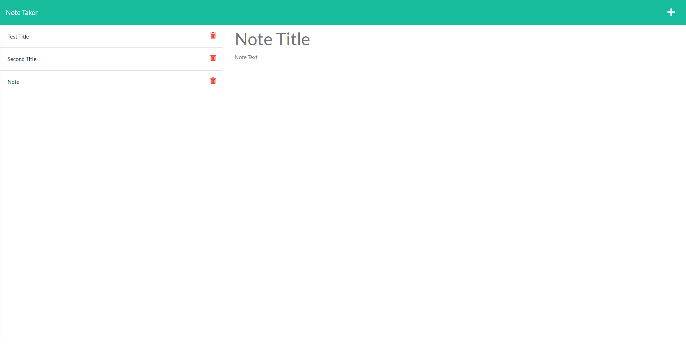

  # Note-taker

   [](https://opensource.org/licenses/MIT)
  
  ## Table of Contents 

  * [Description](#description)

  * [Screenshot](#screenshot)
  
  * [Installation](#installation)
  
  * [Usage](#usage)
  
  * [Contributing](#contributing)
  
  * [Tests](#tests)

  * [License](#license)

  * [Questions](#questions)

  ## Description

  This project is a Express js based application that involves different packages like utils, and file system. Users will be able to write new notes and the notes will be saved in a db.json file. Once a note is made, the note gets an id associated with it so you can click on your saved notes on the left and see what kind of texts you have in the note.

  ## Screenshot 

  
  
  ## Installation 

  To install the necessary dependencies, run the following command:
  
  ```Dependencies
   npm i
  ```  
  ## Usage

  You will need to add the packages to use this repo.
  
  ## Contributing

  If you would like to contribute, you can fork this repo and add to the project.
  
  ## Tests
  
  To run a test, run the following command: 

  ```tests
   npm run test
  ```
  ## License

  This project is licensed under the MIT license 

  ## Questions
  
  If you have any questions about the repo, open an issue contact me directly at [midth002@gmail.com](mailto:midth002@gmail.com). You can find more work at [midth002](https://github.com/midth002)
  
  